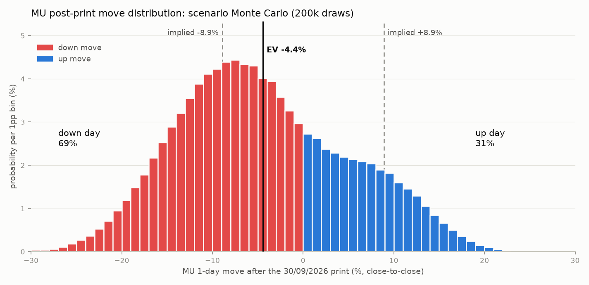

# MU Earnings Edge: FQ4 FY26 print + FQ1 FY27 guide (30/09/2026)

**Run date:** 25/09/2026 · **RUN_MODE:** PRE_PRINT (validated) · **Spot:** $1,094.45 (+1.3%, IBKR live 25/09 09:45 ET) · prior close $1,080.53 (24/09) · **Owner:** Emmanuel
**Event:** results ~16:05 ET 30/09 (≈04:05 MYT 01/10) · call 14:30 MT (16:30 ET = 04:30 MYT 01/10) · KRX reacts 09:00 KST 01/10 (08:00 MYT)

> All probabilities, moves and scores come from code in `analysis/` (see the reproduce block at the end). Every external figure is in the source log (§11) with tier and date. Tier-3 aggregator numbers are shown alongside, never alone.

---

## 0. Premise validation & corrections to the variables block

| Check | Result | Source (tier) |
|---|---|---|
| Report date/time | **Confirmed**: 30/09/2026 after close; call 14:30 MT | Micron PR 26/08/2026 (T1) |
| Print already occurred? | **No**. Latest 8-K Item 2.02 is 24/06/2026 → RUN_MODE stays **PRE_PRINT** | SEC EDGAR (T1) |
| FQ4 guide | **Confirmed**: rev $50.0bn ± $1.0bn; non-GAAP GM ~86%; opex ~$1.65bn; EPS $31.00 ± $1.00 (GAAP $30.73); ~1.15bn shares; tax ~15% | 8-K Ex.99.1 + prepared remarks 24/06 (T1) |
| 14-week FQ4 | **Confirmed**: FY26 = 53 weeks, FQ4 = 14 weeks; FQ1 FY27 = 13 weeks | 10-Q 25/06/2026 (T1) |
| STREET_REV / EPS | **Updated**: six dated snapshots $50.42–51.20bn (mean **$50.69bn**) / $31.14–31.56 (mean **$31.34**). Named sell-side sits above: UBS $52.4bn, GS $51.9bn, Wells-implied ~$53.3bn | §2 |
| MY_BOOK_EXPOSURE list | **Wrong vs live book.** No DRAM ETF, NVDA or MRVL held (MRVL exited 18/09). Live: AMAT 30.5%, SOXX 16.1%, MU 15.3% (6 sh, after a 1-share trim on 23/09), JEPQ, QCOM (bought today), AVGO, LRCX, VRT, BE | IBKR 25/09 (T1) |
| Prior 53-week analog | **FY2020** (FQ4-20 = 14 weeks), not FY2021 | FY21 10-K (T1) |
| Korea peers | KRX **closed 24–26/09 (Chuseok)**; SK hynix/Samsung last traded 23/09 and reprice 28/09 | IBKR (FROZEN) |
| New since the June print | 26/08 8-K: Bhatia → President & COO, DeBoer → President & CTPO, **Sadana (Chief Business Officer, SCA/pricing voice) → Senior Advisor**. July memory crash (MU −39% peak-to-trough). CXMT IPO (+466%). Burry added MU short (22/09) | 8-K (T1); §11 |

---

## 1. Executive verdict

1. **LEAN: Sell-the-news.** P(1-day < −3%) **60–64%**, P(down day) **69%**, P(rally > +3%) **20–23%** (Monte Carlo and factor model agree).
2. **The quarter will beat; the guide is the problem.** P(FQ4 revenue > consensus) 85%, P(EPS beat) 89%, E[rev] $52.4bn. But E[FQ1 guide] is **$55.9bn vs $56.7bn consensus**: P(guide > consensus) 39%, P(> whisper $58.5bn) 22%. The 14→13-week reset compresses headline QoQ from ~+26% to ~+7%.
3. **Implied ±8.9%** (±9.3% at the 24/09 close) ≈ modelled E|move| **8.7%**, so size is fairly priced. **Direction and skew are not.** The market prices P(>+6.9%) at 26% vs our 14%, and P(<−6.8%) at 28% vs our 44%. **EV −4.4%.**
4. **Best edge:** skew. The upside wing is rich, so be long a put spread and short the call wing (institutional sizing only). **For the book:** trim MU 6 → 4 shares pre-print, which restores the cash floor to 7.3%. **Client SPs:** issue after the print.
5. **Confidence: Medium.** The lean survives FQ1 per-week growth up to ~20%. **Key risk:** an FQ1 guide ≥ $58.5bn plus a large buyback (post-09/12 capital return) squeezes a crowded-long / rising-short tape.

---

## 2. Module 1: Consensus stack (what "expectations" actually are)

| Metric                       | Guide lo/mid/hi   |   Mean (snapshots) |   Median |   High |    Low | Whisper   | Dispersion   |
|:-----------------------------|:------------------|-------------------:|---------:|-------:|-------:|:----------|:-------------|
| FQ4 revenue ($bn)            | 49 / 50 / 51      |             50.685 |   50.56  |  53.3  |  50.42 | 52.0-53.5 | 5.7%         |
| FQ4 non-GAAP EPS ($)         | 30 / 31 / 32      |             31.337 |   31.335 |  32.54 |  31.14 | 32.5-34.0 | 4.5%         |
| FQ4 non-GAAP GM (%)          | — / 86 / —        |             87     |   87     |  87.3  |  87    | 87.0-87.5 | 0.3%         |
| FQ1 FY27 revenue guide ($bn) | — / — / —         |             56.7   |   56.7   |  57.7  |  56.4  | 57.5-59.5 | 2.3%         |
| FQ1 FY27 GM guide (%)        | — / — / —         |             87.5   |   87.5   |  88.2  |  87.5  | 88.0-88.5 | 0.8%         |
| FQ1 FY27 EPS guide ($)       | — / — / —         |             35.25  |   35.25  |  37.06 |  35.25 | 36.5-38.0 | 5.1%         |
| FY27 revenue ($bn)           | — / — / —         |            254.55  |  254.55  | 262.3  | 249    | 260-275   | 5.2%         |
| FY27 EPS ($)                 | — / — / —         |            156.53  |  156.53  | 175    | 156.53 | 165-185   | 11.8%        |

*Mean = simple average of dated snapshots (GS-cited 11/09, Investing.com 22/09, aggregators 23–24/09, TipRanks, Motley Fool 24/09). High/Low include named estimates. FY27 revenue snapshots conflict: GS cites $260.1bn (label ambiguous CY/FY), while Wells' "$261.3bn is ~5% above Street" implies ~$249bn. Both are shown; I trust neither to ±2%.*

**Qualitative / no-consensus lines (Tier 1 unless noted)**

| Item | Where it stands (25/09/2026) |
|---|---|
| FQ4 DRAM / NAND / HBM | No public consensus. Model: DRAM ~$39.5–41.5bn (FQ3 $31.3bn; bits +8–13% incl. 14th week; price +10–18%), NAND ~$11.8–13.3bn. >$1bn cumulative HBM4 shipped by FQ3 |
| BU revenue & GM (FQ3) | CMBU $13.8bn/83% · CDBU $11.5bn/87% · MCBU $11.5bn/87% · AEBU $4.6bn/79% |
| Capex | FQ4 ~$10bn; FY26 ~$27bn; FY27 quarterly > FQ4 level (≥$40bn run-rate); Street **$45–48bn** (BofA 24/09, T2) |
| FCF / deposits | FQ4 FCF "to increase substantially again" vs $18.3bn. **SCA deposits (~$18bn cash) sit in financing CF, not FCF** |
| Inventory | 120 days at FQ3; DRAM < 120 |
| HBM4 share / qual | NVIDIA qualified all three for Vera Rubin HBM4 (Bloomberg 05/06, T2). Est. Rubin split: hynix 60–70% / Samsung 25–30% / MU remainder (T3) |
| HBM / DRAM 2027 | MU HBM 2026 sold out; industry reports all 2027 DRAM+HBM capacity booked (T3) |
| SCAs | 16 signed; ~20% of DRAM / ~⅓ of NAND volume CY26–30; target ≥50% of revenue; largest carry a **ceiling ≈ CQ2-26 market price** plus a floor; ~40% of revenue fixed/ceilinged when complete; RPO ~$100bn; deposits $22bn |
| Contract prices | TrendForce: server DRAM +13–18% QoQ in 3Q26; 4Q26 outlook lifted but "moderating"; spot cooling 16/09 (T2) |
| New fabs | ID1 first wafer mid-CY27; ID2 late CY28; NY broke ground Jan-26; Tongluo (TW) mid-CY27; Singapore HBM packaging 1H CY27 |
| Capital return | Increase from 09/12/2026 (CHIPS restriction lapses); "over time return 100% of excess cash" |

- **Dispersion:** FQ4 revenue (high − low)/mean = 5.7%; FQ1 guide 2.3% (thin sample); FY27 EPS 11.8%. Near-term dispersion is moderate and the long-dated number is where disagreement lives.
- **Revision momentum score: +2 (of ±2).** FQ4 consensus +1.1% from 11/09 to 24/09, FY27 raised (Wells +10%, GS +4.9%), while the stock is +15% in 20 days. Rising estimates plus a rising stock means **the bar is being raised into the print.**
- **Whisper triangulation.**
  - (a) Top-quartile sell-side: $52.4–53.3bn / $32.50–32.54.
  - (b) EarningsWhispers $34.14–35.20 EPS (T3, *unverified*: the page didn't render).
  - (c) Previews that say "above consensus": GS FQ1 $57.7bn / 88.1%; Stifel $56.4bn / 88.2%.
  - (d) The price: +15% in 20 days (86th percentile) and +46% off the July low.
  - **Whisper: FQ4 rev $52.0–53.5bn, EPS $32.5–34.0. FQ1 guide rev $57.5–59.5bn, GM 88.0–88.5%, EPS $36.5–38.0.**

> **Verdict (M1):** The real bar is an **FQ1 revenue guide ≥ $57.5bn (≥ $58.5bn to clear the whisper) with GM ≥ 88%**, not the FQ4 print. On a 13-week quarter, $56.7bn needs ~+17% per-week growth on a $52bn FQ4, vs +12.0% embedded in the FQ4 guide. **Confidence: High** (on where the bar is).

---

## 3. Module 2: Beat probability

### 2a. Track record (Tier 1: 36 EDGAR 8-Ks parsed; last 16 shown)

| Print      | Phase   |   Rev $bn |   Guide mid $bn | Rev vs guide mid   | GM vs guide   |   EPS | Next-Q guide QoQ   | Pre-20d   | 1d     | 5d     |
|:-----------|:--------|----------:|----------------:|:-------------------|:--------------|------:|:-------------------|:----------|:-------|:-------|
| 29/09/2022 | down    |      6.64 |            7.2  | -7.7%              | -222bp        |  1.45 | -36.0%             | -11.5%    | +0.2%  | +9.2%  |
| 21/12/2022 | down    |      4.08 |            4.25 | -3.9%              | -314bp        | -0.04 | -7.0%              | -12.7%    | -3.4%  | -1.1%  |
| 28/03/2023 | up      |      3.69 |            3.8  | -2.8%              | -3994bp       | -1.91 | +0.2%              | +2.5%     | +7.2%  | -3.4%  |
| 28/06/2023 | up      |      3.75 |            3.7  | +1.4%              | +493bp        | -1.43 | +3.9%              | -6.4%     | -4.1%  | -8.7%  |
| 27/09/2023 | up      |      4.01 |            3.9  | +2.8%              | +137bp        | -1.07 | +9.7%              | +2.3%     | -4.4%  | -0.1%  |
| 20/12/2023 | up      |      4.73 |            4.4  | +7.4%              | +478bp        | -0.95 | +12.1%             | +2.6%     | +8.6%  | +9.3%  |
| 20/03/2024 | up      |      5.82 |            5.3  | +9.9%              | +697bp        |  0.42 | +13.3%             | +18.1%    | +14.1% | +23.9% |
| 26/06/2024 | up      |      6.81 |            6.6  | +3.2%              | +165bp        |  0.62 | +11.6%             | +7.3%     | -7.1%  | -3.9%  |
| 25/09/2024 | up      |      7.75 |            7.6  | +2.0%              | +196bp        |  1.18 | +12.3%             | -2.1%     | +14.7% | +4.3%  |
| 18/12/2024 | down    |      8.71 |            8.7  | +0.1%              | +1bp          |  1.79 | -9.3%              | +6.3%     | -16.2% | -13.6% |
| 20/03/2025 | down    |      8.05 |            7.9  | +1.9%              | -59bp         |  1.56 | +9.3%              | -0.2%     | -8.0%  | -11.5% |
| 25/06/2025 | up      |      9.3  |            8.8  | +5.7%              | +245bp        |  1.91 | +15.0%             | +32.0%    | -1.0%  | -4.3%  |
| 23/09/2025 | up      |     11.32 |           10.7  | +5.7%              | +368bp        |  3.03 | +10.5%             | +42.9%    | -2.8%  | +0.5%  |
| 17/12/2025 | up      |     13.64 |           12.5  | +9.1%              | +533bp        |  4.78 | +37.1%             | -1.3%     | +10.2% | +27.1% |
| 18/03/2026 | up      |     23.86 |           18.7  | +27.6%             | +692bp        | 12.2  | +40.4%             | +9.7%     | -3.8%  | -17.2% |
| 24/06/2026 | up      |     41.46 |           33.5  | +23.7%             | +391bp        | 25.11 | +20.6%             | +17.0%    | +15.7% | -1.5%  |

*Phase rule: "up" = next-quarter GM guide above current GM. FQ2-23 (28/03/2023) GM included a ~$1.4bn inventory write-down (hence −3,994bp).*

| Window | Beat guide mid | Mean / median beat | Beat above top of range | GM beat rate | Mean 1-day | % up days | **P(down \| beat)** |
|---|---|---|---|---|---|---|---|
| Last 16 | 81% | +5.4% / +3.0% | 50% | 75% | +1.3% | 44% | **62%** |
| Up-phase (12) | 92% | +8.0% / +5.7% | 67% | 92% | +4.0% | 50% | **55%** |
| Down-phase (4) | 50% | −2.4% / −1.9% | 0% | 25% | −6.9% | 25% | 100% |
| Last 8 / last 4 | — | +9.5% / +16.6% | — | — | — | — | — |

**Guide vs consensus for the next quarter (LSEG unless noted):** Sep-25 **+4.7%** ($12.5bn vs $11.94bn) → −2.8%. Dec-25 **≈+32%** ($18.7bn vs ~$14.2bn; recalled, not re-verified) → +10.2%. Mar-26 **+47%** vs a stale Zacks $22.79bn → −3.8% (r5 −17%, capex). Jun-26 **+14.7%** ($50.0bn vs $43.58bn) → +15.7%. **The Street has now adapted:** FQ4 consensus sits only +1.4% over the guide midpoint, but FQ1 consensus embeds *acceleration* per week.

### 2b. Real-time leading indicators (current quarter + FQ1 read)

| Indicator | Reading | Read for FQ4 | Read for FQ1 guide |
|---|---|---|---|
| Korea chip exports 01–20/08 (KCS) | ~$26bn, ~3× YoY | **+** (FQ4 month) | — |
| Korea chip exports 01–20/09 (KCS) | $34.12bn, +259% YoY; **+31% MoM like-for-like (14 vs 14 working days) vs ~+5% seasonal** | + | **+ (strongest bull datapoint; hynix HBM4-led, partly transferable)** |
| DRAM contract (TrendForce) | Server +13–18% 3Q26; 4Q26 lifted but moderating; LTAs cap increases from 3Q26 | + | ± |
| DRAM/NAND spot (TrendForce 16/09) | DDR5 inquiries slowing, some chips softening; NAND wafer −0.3% w/w | 0 | **−** (spot leads contract) |
| SK hynix Q2-26 (29/07) | Record: rev +51% QoQ, 76% OPM; DRAM ASP ~+30% vs GS 39% est.; LTAs with ~10 customers; **stock −9%** | + | − (pricing below hopes; capex +50%) |
| Samsung Q2-26 (30/07) | Record OP KRW 89.5tn; "2027 tighter than 2026"; **stock −7% on capex** | + | ± |
| Hyperscaler capex | 2026 ~$720–745bn (+80% YoY); 2027 modelled >$1tn | + | + |
| NVIDIA Q2 FY27 (26/08) | Q3 guide $108bn vs ~$104bn; memory is the bottleneck through FY28; supply obligations $145bn → **$279bn** (mostly memory) | + | + |
| Sandisk FQ4 (05/08) | Rev +51% QoQ (⅔ price); NAND TAM >$300bn CY26 | + | + |
| Micron mid-quarter | No guidance update. 26/08 exec reshuffle; Research Labs ($10bn/decade) | 0 | 0/− (Sadana transition) |
| Street price trend | TrendForce/GS: CQ3 price rises moderating (GS cut to ~19% from 39% for hynix) | ± | − |

### 2c. Probability outputs (Monte Carlo, 200k draws; assumptions in `analysis/mc_core.py`)

| Question | Probability |
|---|---|
| P(FQ4 revenue > consensus $50.69bn) | **85%** |
| P(FQ4 revenue > high snapshot $51.2bn / guide top $51.0bn) | 75% / 80% |
| P(FQ4 revenue > whisper $52.75bn) | 35% |
| P(FQ4 revenue < guide midpoint $50.0bn) | 7% |
| P(FQ4 EPS > consensus $31.34) | **89%** |
| P(FQ4 EPS > whisper $33.25) | 33% |
| P(FQ4 GM ≥ 87.0% consensus) | 44% |
| **P(FQ1 revenue guide mid > consensus $56.7bn)** | **39%** |
| **P(FQ1 revenue guide mid > whisper $58.5bn)** | **22%** |
| P(FQ1 GM guide ≥ 87.5% consensus) / ≥ 88.25% whisper | 80% / 51% |
| P(FQ1 EPS guide ≥ $35.25 consensus) / ≥ $37.25 whisper | 54% / 25% |
| P(FQ1 headline QoQ < +10%) / flat-or-down | 76% / 7% |
| **Expected beat size:** E[FQ4 rev] $52.37bn = +$1.69bn / **+3.3% vs consensus** (+4.7% vs guide mid); E[EPS] $32.85 (**+4.8%**); E[GM] 86.9% | — |
| **E[FQ1 guide]:** $55.9bn (p10 $51.7bn / p90 $60.5bn) = −1.3% vs consensus; GM 88.3%; EPS $35.62; per-week +15.0%, headline +6.8% | — |

*Key assumptions:*
- *FQ4 beat is a 3-regime mixture (5% N(−1.5%,1.2%) / 65% N(+3.5%,2.0%) / 30% N(+8.5%,3.0%)), cross-checked bottom-up at $49.2–55.2bn.*
- *FQ1 per-week growth is ~N(15%, 5%): ~13% bottom-up (bits +3–5% × price/mix +6–12%, SCA ceilings) plus 2pp for HBM4 mix and the September Korea surge.*
- *Guide inputs reproduce the company's $31.00 EPS exactly.*

**Earnings-quality checklist (strip before calling a beat "clean"):**
- Tax ~15.0% (Pillar Two).
- Shares ~1.15bn (no buyback possible before 09/12).
- Other income ~+$0.55bn implied by the guide (interest on ~$30bn of cash plus FQ4 deposits); >$0.7bn = low-quality upside.
- Loss on debt prepayments is excluded from non-GAAP ($325m in FQ3).
- **SCA deposits must not appear in FCF**; check RPO (~$100bn) and contract liabilities.
- The 14th week adds ~7.7% to revenue *and* opex.
- No inventory write-downs or reversals expected.
- Rule of thumb: each $1bn of revenue above the guide ≈ **+$0.73 EPS**. An EPS beat bigger than that implies non-operating help.

> **Verdict (M2):** Print beat ~85–89%. FQ1 guide vs consensus is a **coin-flip-minus (39%)** and vs whisper unlikely (22%). **Lean: beat the quarter, in-line-to-light headline guide. Confidence: Medium.**

---

## 4. Module 3: What is priced in

### 3a. Options (IBKR MCP: 24/09 close marks and live 25/09 model IVs)

| Metric | Value |
|---|---|
| First expiry after print | **02/10/2026** weekly |
| ATM straddle / spot | **$100.33 / $1,080.53 = 9.28%** (24/09 close) · **8.92%** live (1095 strike, IV 79.3%) · Street quotes 9.9–10.3% (T3) |
| Event-vol strip | σ_event **7.9–9.2%** → pure event E\|move\| **6.3–7.4%** (base vol from 28/09 expiry 41% vs fwd var 02/10→09/10 51%) |
| Term structure (IV) | 28/09 **38.4%** → 02/10 **79.3%** → 09/10 **67.3%** (event hump); IV30 61.0%; HV30 56.3% |
| IV rank / percentile | 52w **~20%**, 26w 12%, 13w 23%: **low**. In June the front IV was 155% with IV rank 100% |
| Skew (02/10, ±7% OTM) | 1170C **81.3%** vs 1020P **77.0%** → **calls +4.3 vol pts** over puts (24/09: 1160C 81.5% vs 1000P 77.2%) |
| Put/call volume | 0.58 on 24/09 (avg 0.64); 0.37 early 25/09: **call-heavy** |
| Largest observed OI (02/10) | 1000P 1,713 · 1080C 1,053. A customer-long / dealer-short 1000P implies a short-gamma pocket below $1,000 (*inference; full-chain OI by holder not exposed*) |

### 3b. Historical realised moves (code: `04_event_study.py`, `05_options_implied.py`; full table in `hist_moves.csv`)

| Measure (last 16 prints) | Value |
|---|---|
| Mean / median \|1-day\| | **7.6% / 7.2%** (last 8: **9.1%**) |
| Mean \|5-day\| | 8.7% |
| Mean \|straddle window\| (close t−4 → t+2, same window as the 02/10 straddle) | **6.7%**. Exceeded today's 9.28% in only **2 of 16 (12.5%)** prints |
| % of prints with \|1d\| > today's straddle-implied | 31% |
| June-26 datapoint | implied ±11.0% vs realised +15.7% |

### 3c. Pre-print drift

| Measure | MU | SOXX | Percentile vs all prints since 2017 |
|---|---|---|---|
| 20-day (to 24/09, = t−4) | **+15.1%** (+17.0% live) | +9.9% | **86th** (81st vs last 16); relative +5.2pp = 61st |
| 10-day / 5-day | +10.6% / +10.5% | — | — |
| From 2026 closing high $1,213 (25/06) | −10.9% | −13.5% | — |
| From July low $739 (29/07) | **+46.2%** | — | — |

*Conditional stats are weak (n=9): prints with a 20-day run-up >10% averaged +1.7% (44% up), vs +0.6% (48% up) otherwise. The run-up is a positioning factor, not a standalone signal.*

### 3d. Valuation-implied expectations

| Metric | Value |
|---|---|
| P/E on FY27 consensus EPS $156.53 | **6.9×** (6.5× on Wells $166; 17.4× on GS "normalised" $62) |
| History: P/E on *realised* peak NTM EPS | 2018 cycle **3.4×** (Dec-17; min 2.8×) · 2021 cycle **8.9×** (Jun-21; min 8.2×) |
| EPS the price requires at peak multiples | 4× → $270 · 5× → $216 · 6× → $180 · 8× → $135 · 10× → $108 |
| Mean / high PT | $1,515–1,565 (TipRanks / Fool, 28–29 Buy / 1 Hold) → **+40–45%**; Investing.com shows $1,296 (stale-PT conflict); range to $2,000; GS $1,100 (Neutral) |
| Market cap | ~$1.22–1.24tn |

Reading: 6.9× sits **between** the 2018 (3.4×) and 2021 (8.9×) peak multiples. The price is discounting **FY27 as the peak** with no SCA-durability re-rating. It is neither a bubble multiple nor a floor.

### 3e. Positioning & sentiment

- **Short interest.** 29.7–37.3m shares (2.6–3.3% of float, DTC ~1), at a multi-year high. Burry added "in some size" on 22/09 with a China/DDR4 oversupply thesis. Low, but it is squeeze fuel on a clean beat-and-raise.
- **Crowding.** GS hedge-fund VIP crowding hit a record in Q2-26, and MU was Coatue's top Q2 buy. The DRAM ETF (Roundhill) has **$26bn AUM**, and there is heavy leveraged-ETF activity (MUU, RAM, DRAL). Retail sentiment on Stocktwits is neutral→bullish.
- **Ratings.** ~28–29 Buy / 1 Hold (GS Neutral) / 0 Sell.
- **Last 30 days of target changes.** Citi $1,150→$1,300 (23/09). Wells $1,525→$1,400 (23/09, citing "peak earnings uncertainty"). GS Neutral $1,100 (11/09). Stifel $1,500 (21/09). UBS $1,625 reiterated. BofA $1,550 reiterated (24–25/09).
- **ETF / flows context.** The memory complex is still −25% (DRAM ETF, SNDK) to −36% (SK hynix) from its June highs, while MU is −11%. **MU is the most "recovered" name in the group.**

> **Verdict (M3):** The market is pricing a **±8.9% move with a mildly bullish (call-rich) skew**. The bar embedded in the price is ≈ an **FQ1 guide of $57.5–58.5bn** (the whisper; ~17–19% per-week growth), not the $56.7bn consensus. **Confidence: Medium.**

---

## 5. Module 4: Institutional lens (ranked debates & bogeys)

| # | Debate | Bull bogey (buy) | Bear bogey (de-risk) | Marginal flow |
|---|---|---|---|---|
| 1 | **FQ1 guide & the 14→13-week optics** | FQ1 rev ≥ $58.5bn (≥ +18% per week); mgmt bridges per-week growth unprompted | Guide ≤ $55.8bn, or headline QoQ ≤ +5% vs FQ4's ~+26% ("peak growth") | HF momentum sells an in-line guide; quants de-gross on a gap-down |
| 2 | **Peak GM / pricing trajectory** | FQ1 GM ≥ 88.5%; "price increases continue into CQ4 and 1H27" | GM guide < 87.5%; words like "stabilising / plateau / normalising" | Long-only GARP buys ≥88% GM; HF sells on plateau language |
| 3 | **SCA durability & quality of earnings** | >20 SCAs, ≥50% revenue coverage, deposits > $30bn, new-product price premia | "Ceilings binding" (CQ2-26 cap on ~40% of revenue); deposits flattering cash optics | Long-only rewards visibility; HF fades "capped upside" |
| 4 | **Capex / supply response** | FY27 capex ≤ $45bn, construction-weighted (bits not until 2027–28) | FY27 capex ≥ $55bn / greenfield pull-in; on top of hynix +50%, Samsung P4/P5, CXMT's $8.6bn IPO | Memory longs sell a capex spike; **semicap (AMAT/LRCX) is the buyer** |
| 5 | **Capital return** | ≥ $50bn authorisation with a start date of 09/12 (BofA: 8–10% of shares) | Framework restated, no size | Long-only and income add on size |
| 6 | **HBM4 share & pricing** | MU HBM share ≥ its DRAM share (~20–25%); 2027 HBM sold out at higher prices | "Competitive HBM pricing"; Samsung gaining Rubin share (25–30%); GS-style HBM price-decline talk | Thematic AI funds |
| 7 | **Macro / regime** | Hyperscaler capex ≥ $1tn in 2027 reaffirmed; memory exempted from 232 Phase 2 | Tariff Phase 2 on servers/memory; export controls; Burry / CXMT supply narrative; exec transition (who owns SCAs after Sadana?) | Macro / CTA flows |

> **Verdict (M4):** The single variable that decides the stock's direction is **the FQ1 FY27 revenue guide midpoint vs $56.7bn**, i.e. whether per-week growth holds at **≥ ~16%** after the 14→13-week reset. GM ≥ 88% and the size of the buyback are the tiebreakers. **Confidence: High.**

---

## 6. Module 5: Full scenario matrix (Print × Guide × Tone + tails)

**Method** (`09_scenarios.py` on `mc_core.py`).
- (i) Joint print/guide states from the Module-2c draws.
- (ii) Tone conditional on guide: e.g. P(Very bullish | above whisper) = 0.45; P(Mixed | below consensus) = 0.50.
- (iii) 1-day move ~ N(a_print + a_guide + a_tone − 1.5 positioning, 4.25%).
- (iv) Explicit tails. T1–T3 and T5–T8 carry fixed probabilities (13.9% in total) that replace base mass. T4 (sandbag, 6.2%) is derived from the draws.

The coefficients were **back-tested on the last 10 prints: 8/10 direction hits, MAE 3.7pp** (table below).

| Scenario                                                                                 | Prob   | E[1d]   | Range p10/p90   | Med FQ4 rev   | Med FQ1 guide   | Headline                                                                                             | Peer / read-through                                                                       |
|:-----------------------------------------------------------------------------------------|:-------|:--------|:----------------|:--------------|:----------------|:-----------------------------------------------------------------------------------------------------|:------------------------------------------------------------------------------------------|
| S1 Blowout: beat + guide above whisper + very bullish tone                               | 8.5%   | +11.3%  | +6% / +17%      | $54.4bn       | $60.3bn         | 'Micron smashes estimates, guides FQ1 far above Street; 2027 sold out at higher prices; big buyback' | Hynix/Samsung +5-10% next KRX session; SNDK/WDC/STX up; AMAT/LRCX up on capex; SOXX +2-3% |
| S2 Beat & raise above whisper (clean or mixed tone)                                      | 10.1%  | +6.7%   | +1% / +13%      | $54.4bn       | $60.3bn         | 'Micron beat-and-raise tops whisper'                                                                 | Korea memory +3-6%; SOXX +1-2%                                                            |
| S3 Beat, guide above cons/below whisper, clean/bullish                                   | 4.8%   | +3.4%   | -3% / +10%      | $53.0bn       | $58.0bn         | 'Solid beat, guide above consensus but not the buy-side number'                                      | memory peers flat-to-up; muted                                                            |
| S4 Beat, guide above cons/below whisper, mixed tone                                      | 2.1%   | -1.3%   | -7% / +4%       | $53.0bn       | $58.0bn         | 'Beat and raise, but capex jump / price moderation cap the upside'                                   | memory peers down 1-4%; semicap up on capex                                               |
| S5 Beat, in-line guide, clean/bullish                                                    | 8.4%   | -1.2%   | -7% / +5%       | $52.5bn       | $56.7bn         | 'Record quarter, in-line outlook; stock digests run'                                                 | flat-to-down memory; SOXX flat                                                            |
| S6 Beat, in-line guide, mixed tone                                                       | 5.5%   | -5.5%   | -11% / +0%      | $52.5bn       | $56.7bn         | 'Growth deceleration and capex overshadow record results'                                            | Korea memory -3-6%; SNDK down                                                             |
| S7 Beat, guide below cons but very bullish offsets (buyback/SCA expansion)               | 2.0%   | -2.4%   | -8% / +3%       | $52.0bn       | $54.6bn         | 'Soft headline guide, but $bn buyback / new SCAs reassure'                                           | mixed; MU outperforms peers                                                               |
| S8a Beat, guide modestly below cons (13-week optics), clean/mixed                        | 12.9%  | -7.2%   | -13% / -1%      | $52.1bn       | $54.9bn         | 'Micron's guide falls short as growth slows' (14->13 week optics)                                    | Korea memory -4-8%; SOXX -1-2%                                                            |
| S8b Beat, guide well below cons (<-5%), clean/mixed                                      | 6.7%   | -11.3%  | -17% / -5%      | $51.8bn       | $53.1bn         | 'Micron outlook disappoints; peak-cycle fears return'                                                | Korea memory -6-10%; SNDK/WDC -5-10%; SOXX -2-3%                                          |
| S9 In-line print, guide >= consensus                                                     | 2.4%   | -4.5%   | -12% / +4%      | $50.9bn       | $56.8bn         | 'In-line quarter, guide steadies nerves'                                                             | flat                                                                                      |
| S10 In-line print, guide below consensus                                                 | 9.8%   | -12.2%  | -19% / -5%      | $50.8bn       | $53.5bn         | 'Micron merely meets the Street and guides light'                                                    | Korea memory -5-8%                                                                        |
| S11 Print miss (any guide)                                                               | 6.5%   | -16.1%  | -23% / -9%      | $49.5bn       | $52.3bn         | 'Micron misses as SCA price caps bite'                                                               | memory complex -6-12%                                                                     |
| T1 Capex shock (FY27 capex >= $55bn / greenfield pull-in)                                | 4.0%   | -8.0%   | -13% / -3%      | $52.1bn       | $55.8bn         | 'Micron's spending spree revives supply-glut fears'                                                  | MU/Hynix/Samsung down; AMAT/LRCX/KLAC UP 3-6%                                             |
| T2 Pricing-peak language (pricing flattening in 2027, SCA ceilings binding)              | 3.0%   | -12.0%  | -17% / -7%      | $52.2bn       | $55.8bn         | 'Micron signals memory price peak'                                                                   | all memory -8..-15%; SNDK/WDC/STX down; SOXX -3..-5%                                      |
| T3 SCA accounting noise (deposits/RPO/revenue-timing confusion)                          | 1.5%   | -4.0%   | -8% / -0%       | $52.1bn       | $55.7bn         | 'Quality-of-earnings questions cloud record quarter'                                                 | MU-specific; peers flat                                                                   |
| T4 Guide sandbagged: flat/down headline QoQ on 13-week FQ1                               | 6.2%   | -13.5%  | -20% / -7%      | $51.5bn       | $50.6bn         | 'Micron guides revenue flat - peak growth is here' (14->13 week optics + conservatism)               | Korea memory -6-10%; SOXX -2-3%                                                           |
| T5 Macro shock on the day (tariff Phase 2 incl. memory, rates, geopolitics)              | 2.0%   | -6.0%   | -12% / +0%      | $52.1bn       | $55.7bn         | 'Chip stocks slide on tariff/macro headline'                                                         | broad SOXX down; Korea memory down                                                        |
| T6 Export-control headline (China/HBM rules)                                             | 1.0%   | -5.0%   | -10% / +0%      | $52.1bn       | $55.7bn         | 'New export curbs hit memory makers'                                                                 | Korea memory down more than MU; semicap down                                              |
| T7 Management headline (CEO succession / exec exits)                                     | 1.0%   | -1.9%   | -7% / +3%       | $52.2bn       | $55.9bn         | 'Micron names successor / exec shuffle'                                                              | MU-specific                                                                               |
| T8 Positive exogenous shock (memory tariff exemption / hyperscaler capex raise same day) | 1.5%   | +5.0%   | +0% / +10%      | $52.1bn       | $55.6bn         | 'Chip stocks jump on tariff relief / capex headline'                                                 | SOXX up; Korea memory up                                                                  |


sum = 100.0%

**EV summary**

| Output | Value |
|---|---|
| **Probability-weighted expected 1-day move** | **−4.4%** (median −5.4%) |
| P(up day) / P(down day) | **31% / 69%** |
| P(rally > +3%) / P(sell-off < −3%) / P(chop ±3%) | 23% / 60% / 18% |
| E\|move\| vs implied | 8.7% vs 8.9%. P(\|move\| > implied) **45%** |
| **P(beat AND stock down): the sell-the-news probability** | **55%** (P(down \| print beat) 65%; P(down \| beat *and* raise) 34%) |
| Tails of the distribution | p05 −18.6% · p25 −11.2% · p75 +2.1% · p95 +12.2% |



**Sensitivity: the one assumption that matters** (FQ1 per-week growth × positioning penalty; 60k draws each)

| FQ1 per-week growth (mean)   | P(FQ1 guide > $56.7bn)   | EV (pos 0)   | EV (pos -1.5, central)   | EV (pos -3)   | P(up) central   | P(beat & down) central   |
|:-----------------------------|:-------------------------|:-------------|:-------------------------|:--------------|:----------------|:-------------------------|
| 12.0%                        | 24%                      | -5.4%        | -6.6%                    | -7.9%         | 21%             | 64%                      |
| 13.0%                        | 29%                      | -4.7%        | -6.0%                    | -7.2%         | 24%             | 61%                      |
| 14.0%                        | 34%                      | -3.9%        | -5.2%                    | -6.5%         | 27%             | 58%                      |
| 15.0%                        | 39%                      | -3.2%        | -4.4%                    | -5.7%         | 30%             | 55%                      |
| 16.0%                        | 45%                      | -2.4%        | -3.7%                    | -5.0%         | 34%             | 52%                      |
| 17.4%                        | 53%                      | -1.2%        | -2.5%                    | -3.8%         | 39%             | 47%                      |
| 20.0%                        | 67%                      | +0.8%        | -0.5%                    | -1.8%         | 49%             | 37%                      |
| 22.0%                        | 77%                      | +2.2%        | +0.9%                    | -0.4%         | 56%             | 31%                      |

The sell-the-news lean holds for per-week growth up to ~20%. The Street-implied case on a $52bn FQ4 (17.4%) still gives EV −2.5% and P(up) 39%. EV flips positive only at ≥ ~21% per-week growth (≈ an FQ1 guide ≥ $58.5bn on a $52bn FQ4).

**Response-function back-test**

| date       | print    | guide                | tone         |   positioning |   predicted |   actual_r1 |   error | direction_hit   |
|:-----------|:---------|:---------------------|:-------------|--------------:|------------:|------------:|--------:|:----------------|
| 20/03/2024 | Big beat | Above whisper        | Very bullish |          -1.5 |        12   |        14.1 |     2.1 | True            |
| 26/06/2024 | Beat     | In-line              | Clean        |          -1.5 |        -2.5 |        -7.1 |    -4.6 | True            |
| 25/09/2024 | Beat     | Above whisper        | Very bullish |           0   |        11.5 |        14.7 |     3.2 | True            |
| 18/12/2024 | In-line  | Below (severe)       | Mixed        |           0   |       -14   |       -16.2 |    -2.2 | True            |
| 20/03/2025 | Beat     | Above cons < whisper | Mixed        |           0   |        -0.5 |        -8   |    -7.5 | True            |
| 25/06/2025 | Beat     | Above cons < whisper | Clean        |          -1.5 |         1.5 |        -1   |    -2.5 | False           |
| 23/09/2025 | In-line  | Above cons < whisper | Clean        |          -1.5 |        -1.5 |        -2.8 |    -1.3 | True            |
| 17/12/2025 | Beat     | Above whisper        | Very bullish |           0   |        11.5 |        10.2 |    -1.3 | True            |
| 18/03/2026 | Big beat | Above whisper        | Mixed        |          -1.5 |         4.5 |        -3.8 |    -8.3 | False           |
| 24/06/2026 | Big beat | Above whisper        | Very bullish |          -1.5 |        12   |        15.7 |     3.7 | True            |

MAE 3.7pp; residual sd 4.2pp (hence cell sd 4.25pp). Labels for 2024–25 use recalled LSEG consensus and are flagged in `calibration.csv`.

---

## 7. Module 6: Rally vs sell-the-news diagnostic

| factor                           |   weight |   score_-2_to_+2 |   contribution | evidence                                                                                                                                                                                                                                                                                                                                               |
|:---------------------------------|---------:|-----------------:|---------------:|:-------------------------------------------------------------------------------------------------------------------------------------------------------------------------------------------------------------------------------------------------------------------------------------------------------------------------------------------------------|
| Pre-print run-up percentile      |     0.15 |            -1.5  |         -0.225 | 20d +15.1% (as of 24/09) = 86th pctile of prints since 2017; +5.2pp vs SOXX; +46% off 29/07 low; +16.6% in the week to 22/09                                                                                                                                                                                                                           |
| IV rank / implied vs realised    |     0.1  |             0.25 |          0.025 | IV30 61% at 52w IV pctl ~20% (not euphoric); straddle-implied 8.9% vs last-8 mean \|1d\| 9.1% -> options not over-bid                                                                                                                                                                                                                                  |
| Estimate revision momentum       |     0.15 |            -1    |         -0.15  | FQ4 consensus drifting up (+1.1% 11/09->24/09), FY27 EPS raised (Wells +10%, GS +4.9%) while stock +15%: bar being raised into print                                                                                                                                                                                                                   |
| Guide vs whisper gap (Module 2c) |     0.25 |            -1.25 |         -0.312 | P(FQ1 guide > consensus) 39%, P(> whisper) 22%; 14->13 week optics: E[headline QoQ] +6.8% vs FQ4 +26%                                                                                                                                                                                                                                                  |
| Positioning crowding             |     0.1  |            -0.75 |         -0.075 | GS HF crowding at record (Q2-26); MU = Coatue's top Q2 buy; DRAM ETF AUM $26bn; call-over-put skew +4.3 vol pts; offset: SI only 2.6-3.3% of float (DTC ~1) though multi-year high; Burry short = squeeze fuel on a clean beat                                                                                                                         |
| Valuation vs peak-cycle history  |     0.1  |             0.5  |          0.05  | 6.9x FY27 consensus EPS $156.53 vs P/E on realised peak NTM EPS 3.4x (2018) / 8.9x (2021); mean PT $1,515-1,565 (+40-45%): valuation cushions a dip, doesn't stop a sell-the-news day                                                                                                                                                                  |
| Historical analogs               |     0.15 |            -1    |         -0.15  | Up-cycle beat-and-raise often sold: Mar-18 -8.0%, Jun-24 -7.1%, Sep-25 -2.8%, Mar-26 -3.8% (r5 -17%) vs rallies Dec-25 +10.2%, Jun-26 +15.7% (guide +15-32% vs cons). Last 14-week FQ4 (Sep-20): guide -14% headline QoQ, stock -7.4%. Peers on record prints: SK Hynix Q2-26 -9%, Samsung Q2-26 -7% (capex). Last 16Q: P(down \| beat vs guide) = 62% |

| Outcome | Factor model | Monte Carlo cross-check | MU last-16 base rate |
|---|---|---|---|
| **Rally (> +3%)** | **20%** | 23% | 38% |
| **Sell-the-news (< −3%)** | **64%** | 60% | 44% |
| **Chop (±3%)** | **16%** | 18% | 19% |

**Composite score −0.84 (scale ±2).** The three drivers:
- **Guide vs whisper gap** (−0.31): P(> consensus) 39%, P(> whisper) 22%, plus the 13-week optics.
- **Pre-print run-up** (−0.23): 86th percentile, +46% off the low.
- **Revision momentum** (−0.15): estimates chased up while the stock ran.

Valuation (+0.05) and a low IV rank (+0.03) are the only offsets.

**Historical analogs.**
- MU up-cycle beat-and-raise prints were sold in Mar-18 (−8.0%), Jun-24 (−7.1%), Sep-25 (−2.8%) and Mar-26 (−3.8%, then −17% over 5 days). They rallied only when the guide cleared consensus by 15–32% (Dec-25 +10.2%, Jun-26 +15.7%).
- The last 14-week FQ4 (29/09/2020) guided −14% headline QoQ, and the stock fell −7.4%.
- In Sep-21 the FQ1-22 guide was 10.7% below consensus (−5% after hours).
- Peers sold their record prints this cycle: SK hynix Q2-26 −9%, Samsung Q2-26 −7%.

---

## 8. Module 7: Where the edge is

| edge                        |   score_0_5 | confidence   | evidence                                                                                                                                                                                                                                                                      | expression                                                                                                                                                                                                 |
|:----------------------------|------------:|:-------------|:------------------------------------------------------------------------------------------------------------------------------------------------------------------------------------------------------------------------------------------------------------------------------|:-----------------------------------------------------------------------------------------------------------------------------------------------------------------------------------------------------------|
| 1 Directional               |         3   | Medium       | Model EV -4.4%, P(down) 69% vs a market that prices upside richer. Lean survives the growth sweep (EV<0 for FQ1 per-week growth <=20%).                                                                                                                                       | Personal book: underweight MU into print (trim, don't flip). Institutional: Oct-9 1020/940 put spread (defined risk).                                                                                      |
| 2 Vol (straddle)            |         1.5 | Low          | Straddle +/-8.9% ~= model E\|move\| 8.7% and last-8 mean \|1d\| 9.1%; t-4->t+2 window exceeded implied only 12% of prints but event-only vol (E\|move\| 6.3-7.4%) is not rich. Net: noise.                                                                                    | No outright long/short straddle. If forced: short Oct-2 iron condor wings >= +/-12% (calendar risk from 20% tails).                                                                                        |
| 3 Skew                      |         3.5 | Medium       | Market: 7%-OTM call IV 81.3% > put IV 77.0% (+4.3 vol pts). Model distribution is shifted left (mean -4.4%): P(< -6.8%) 44% vs market-implied P(S<1020) 28%; P(> +6.9%) 14% vs market-implied P(S>1170) 26%. The market over-prices the right tail and under-prices the left. | Buy Oct-9 1020/940 put spread, sell Oct-9 1170/1240 call spread: ~$3.8 net debit (BS on IBKR IVs, verify live). 1 lot = $109k notional, max loss ~$7.4k -> institutional sizing only, NOT for a $43k book. |
| 4 Relative value            |         2   | Low          | MU -11% vs 2026 high while SK Hynix -36%, SNDK -25%, DRAM ETF -25%: MU carries the most 'already-recovered' expectations; 14->13-week optics are MU-specific.                                                                                                                 | Pair: short MU / long SK Hynix (KRX, reopens 28/09) into the print; hedges sector beta, isolates MU optics. Small size; KRX access/FX friction.                                                            |
| 5 Read-through              |         2.5 | Medium       | Hynix next-session beta 0.34 (corr 0.70); LRCX beta 0.36, AMAT beta 0.33. Capex channel is the exception: an FY27 capex guide >= $50bn is MU-negative but semicap-positive (T1).                                                                                              | Korea memory at the 01/10 open reprices at ~0.3x MU's move (hynix beta 0.34, Samsung 0.16); semicap: fade MU-driven weakness in AMAT/LRCX only if the capex guide is >= $45-50bn.                          |
| 6 Post-print drift          |         1.5 | Low          | Up-cycle prints: mean days 2-20 drift after a down day -1.0% vs after an up day +1.4%; only 30% of up-cycle down days were recovered by day 20; up-cycle days < -5% (n=3: Mar-18, Jun-21, Jun-24) extended -9.7% over days 2-20.                                              | Do NOT bottom-fish day 1 of a sell-the-news: historically the first down day is not the low. Re-assess after Samsung prelim (~07/10).                                                                      |
| 7 Structured-product timing |         3.5 | High         | Event premium sits in the weekly (Oct-2 IV 79% vs IV30 61%, 52w IV pctl ~20%): a 3-6M KIKO/ELN struck pre-print earns little extra coupon but carries the full gap risk (model p05 -19%; MU drew down -39% in Jun-Jul 2026).                                                  | Issue AFTER the print (01-02/10) on single-name MU (not a worst-of memory basket: Hynix/SNDK drawdowns -55/-57%); strike 90-95%, KI 60% for 6M (40% buffer = ~4.5x implied move), 65% only for <=3M.       |

- **Real edges:**
  - **Skew (3.5, Med).** The market charges more for the upside tail it is less likely to get.
  - **Structured-product timing (3.5, High).** The event premium sits in the weekly, not the 3–6M tenor.
  - **Directional (3.0, Med).**
- **Noise:** straddle vol (1.5; implied ≈ modelled |move|), post-print drift (1.5; small n), the RV pair (2.0; KRX access and Chuseok friction).
- **Read-through (2.5)** is real but mostly *timing*. Korea at the 01/10 09:00 KST open reprices at ~0.3× beta to MU's move, corr 0.70. Semicap is only a hedge through the **capex** channel. On an ordinary MU print AMAT and LRCX move *with* MU (β 0.33 / 0.36).
- **Single best risk/reward:** the **skew trade**. Oct-9 1020/940 put spread financed by selling the 1170/1240 call spread, ≈$3.8 debit (Black-Scholes on IBKR IVs; verify live). It monetises the left-shifted distribution while selling the over-bid right tail. **For the personal book this is the wrong instrument** (1 lot = $109k notional, max loss ~$7.4k = 17% of NLV, possible HLB derivatives restrictions). The book expression is the trim in §9.
- **Structured products (CLIENT_SP_ANGLE = ON).**
  - **Issue after the print (01–02/10).** The 3–6M implied vol barely contains the event, so pre-print issuance earns little extra coupon for full gap risk (model p05 −18.6%).
  - **Underlying:** single-name MU, **not a worst-of memory basket.** In the Jun–Jul 2026 drawdown hynix fell −55% and SNDK −57%, vs MU −39%.
  - **Structure:** strike 90–95%. KI **60%** for 6M (a 40% buffer ≈ 4.5× the implied move and just outside MU's July −39% drawdown). KI 65% only for ≤ 3M tenors.

---

## 9. Module 8: Personal book exposure & action (via `portfolio-reallocation-discipline`)

**Live book (IBKR 25/09/2026).** NLV **$42,750**. Cash **$941 = 2.2%**, below the 6–8% floor. 81% semis/AI hardware; 90% including AI infrastructure (VRT, BE).

| symbol   |   quantity |   market_value_usd |   weight_pct_nlv |   beta_to_MU_print |   corr |   mu_beta_exposure_usd |
|:---------|-----------:|-------------------:|-----------------:|-------------------:|-------:|-----------------------:|
| AMAT     |      27.01 |           13039.5  |            30.5  |               0.33 |   0.69 |                4349.33 |
| MU       |       6    |            6560.4  |            15.35 |               1    |   1    |                6560.4  |
| SOXX     |      12    |            6889.55 |            16.12 |               0.19 |   0.78 |                1278.71 |
| JEPQ     |      50    |            3064    |             7.17 |               0.04 |   0.37 |                 110.32 |
| QCOM     |      15    |            2943    |             6.88 |               0.14 |   0.68 |                 421.05 |
| AVGO     |       8    |            2840    |             6.64 |               0.09 |   0.45 |                 256.19 |
| LRCX     |       8    |            2500    |             5.85 |               0.36 |   0.75 |                 891.38 |
| VRT      |      10    |            2510    |             5.87 |               0.11 |   0.48 |                 265.64 |
| BE       |       5    |            1358.65 |             3.18 |               0.15 |   0.29 |                 209.15 |
| 45757.HK |    3000    |              62.35 |             0.15 |               0    |   0    |                   0    |

| Book metric | Now | After trim (MU 6 → 4 sh) |
|---|---|---|
| MU weight | 15.3% | **10.2%** |
| Cash | $941 (2.2%) | **$3,129 (7.3%): floor restored** |
| MU-event beta exposure | $14,342 (33.5% NLV) ≈ **$143 per 1% MU move** | $12,160 |
| E[print-day P&L] | −$639 (−1.5% NLV) | −$542 |
| p05 print-day P&L | **−$2,665 (−6.2% NLV)** | −$2,259 (−5.3%) |
| p95 print-day P&L | +$1,738 | +$1,473 |

**Skill output**

1. **Per-position fundamental verdicts (written before any capital math).**
   - **MU:** thesis intact (supply tight beyond CY27, SCA floors, 6.9× FY27 EPS) → *hold core*. It is **structurally overweight** (15.3% > 10% satellite cap) *and* faces a binary event.
   - **AMAT:** 30.5%, added on 11 occasions since 02/07 (fills from $593 down to $421); thesis supported by memory capex, but it is the book's **binding concentration**. Needs an AMAT-specific review (China, WFE) before any action.
   - **SOXX:** diversified; β 0.19 to MU prints → hold.
   - **LRCX / AVGO / QCOM / VRT / BE / JEPQ:** not event-binary → hold. QCOM, bought today, breached the cash floor.
2. **Action.** **Trim MU by 2 shares (6 → 4) before 30/09.** This reduces, not eliminates: MU 15.3% → 10.2% and cash back to 7.3%. The trigger is "pre-earnings binary risk" plus "structurally overweight." **No capital is being sourced for a new entry.**
3. **Standalone sell test: PASS.** I would recommend this trim with no new names in view. It rests on (a) weight > 10% satellite cap, (b) a binary event with a 69% modelled down-day probability, (c) a cash-floor breach. It is *not* capital math.
4. **Sizing constraint acknowledged.**
   - No new sizing until cash is back inside 6–8%.
   - **Do not add** MU, DRAM, SNDK or hynix into the print.
   - **AMAT:** do not trim pre-print. The capex channel partly hedges MU's worst idiosyncratic tail (T1), and a trim needs a standalone fundamental case. Schedule a staged review toward ≤ 15–20% after the MU print (the capex guide is itself an AMAT input) and before AMAT's own November print.
5. **Skill-context note.** The skill's stored portfolio context (VOO anchor, MSFT/META/NVDA satellites, ~$52K) is **stale**. This analysis used the live IBKR book.

**HLB personal-dealing flags (compliance; not legal advice).**
- (i) Obtain **pre-clearance** before trimming MU. Under FIFO the 6 remaining MU lots date from 07/07–06/08 (matches IBKR avg cost $865), so they are ≥ 50 days old and clear a typical 30-day minimum holding period.
- (ii) With CLIENT_SP_ANGLE on, **do not trade MU or memory names ahead of client KIKO/ELN issuance or client orders** (front-running / conflict); keep the timing record.
- (iii) The 90-day blotter shows frequent 1–2-day round trips (SOXL, TQQQ, MRVL, AAOI, LYTE, ARM, GOOG). Check them against HLB minimum-holding and short-term-trading rules before any further tactical trades.
- (iv) Many bank policies restrict employee derivatives trading. That is another reason the book expression is shares, not options.

---

## 10. Module 9: Live-print playbook (01/10/2026, MYT)

**Timeline (MYT).**
- 04:05: results / 8-K.
- 04:30: call.
- 08:00: KRX open (SK hynix, Samsung; first session with the MU print).
- 16:00: US pre-market.
- 21:30: US open.
- ~07/10: Samsung Q3 preliminary results (next catalyst).

**Read order and thresholds** (maps to §6 scenarios; from `data/playbook_thresholds.csv`)

| Read | Very bullish | Bullish | In line | Bearish | Very bearish |
|---|---|---|---|---|---|
| 1. FQ1 rev guide mid | ≥ $58.5bn → S1/S2 (+7 to +11%) | $57.55–58.5bn → S3/S4 (+3 / −1%) | $55.85–57.55bn → S5/S6 (−1 / −5.5%) | $53.9–55.85bn → S8a (−7%) | < $53.9bn or ≤ FQ4 actual → S8b/T4 (−11 to −13%) |
| 2. FQ1 GM guide | ≥ 88.5% | 88.0–88.5% | 87.5–88.0% | 87.0–87.5% | < 87.0% |
| 3. FQ1 EPS guide | ≥ $37.25 | $36.0–37.25 | $34.5–36.0 | $33.0–34.5 | < $33.0 |
| 4. FQ4 revenue / EPS | ≥ $53.5bn / ≥ $34.0 | $52.75–53.5bn / $33.25–34.0 | $51.2–52.75bn / $31.6–33.25 | $50.2–51.2bn / $31.0–31.6 | < $50.2bn / < $31.0 (S11, −16%) |
| 5. FY27 capex | ≤ $42bn | $42–45bn | $45–50bn | $50–55bn | ≥ $55bn → T1 (MU −8%, AMAT/LRCX +3–6%) |
| 6. Buyback / SCA / pricing | ≥ $50bn authorisation; >20 SCAs; "increases continue into 1H27" | $25–50bn; more SCAs | Framework restated; "meaningful moderation" | "Stabilising" | "Plateau / flat"; ceilings binding → T2 (−12%) |

**Per-week check (do this first).** FQ1 guide ÷ 13 vs FQ4 actual ÷ 14.
- ≥ +16% per week: the fundamentals are fine even if the headline looks light. Expect some day-2 repair *only if* management bridges it on the call.
- < +12% per week: genuine deceleration. Don't fade the sell-off.

**After-hours benchmarks & fade/follow (last 16 prints, `13_playbook.py`).**
- **Gap-ups > +2%** (n=6, avg +13%) faded **−1.0%** on average by the close; only 33% extended. **Sell into big gap-ups.**
- **Gap-downs < −2%** (n=6, avg −6.2%) **extended 83% of the time** (−1.0% open→close). **Don't buy the open.**
- The print-day session fell from the open in **13 of 16** prints. corr(gap, 1-day) = 0.96: the gap sets the day.
- "Normal" after-hours by scenario: S1 +8–15% · S2 +4–10% · S3 0 to +6% · S5/S6 −3 to +2% · S8a −4 to −9% · S8b/T4 −8 to −15%.

**Call lexicon.**
- **Bullish:** "sold out for calendar 2027", "price increases continue", "new SCAs / higher deposits", "new-product premia", "HBM share above DRAM share", "demand significantly exceeds supply through 2028", "return 100% of excess cash", authorisation size.
- **Bearish:** "moderation / stabilising / normalising", "within price bands / ceilings", "customer inventory / digestion", "pull-in construction capex", "greenfield acceleration", "competitive HBM pricing", "extra week / 13 weeks", "consumer / PC / handset units down", "tariffs", "China".

**Next-day checks.**
- SK hynix / Samsung at 08:00 MYT: expect ~0.3–0.5× MU's after-hours % (β 0.34 hynix, 0.16 Samsung).
- SOXX pre-market: β 0.19.
- Sell-side PT changes overnight: cuts citing "peak growth" confirm S8.
- Leveraged-ETF / DRAM ETF flows.
- A day-1 down move is historically not the low (up-cycle down days: only 30% recovered by day 20). Re-assess after Samsung's preliminary Q3.

**POST_MORTEM protocol.**
- Re-run `analysis/` with actuals. Record realised print/guide/tone labels, the 1-day move, P(realised cell), and \|error\| vs E[move].
- If the guide cleared $56.7bn with per-week growth ≥ 18%: raise `g_mu` and cut the guide-gap factor weight (0.25 → 0.20).
- If the print sold off despite a guide ≥ whisper: raise the positioning weight.
- Append the quarter to `calibration.csv`.

---

## 11. Source log (every external figure: value, source, tier, date)

| figure                       | value                                                                                                                                                                        | source                                                                                                                                                                                             | tier   | date          |
|:-----------------------------|:-----------------------------------------------------------------------------------------------------------------------------------------------------------------------------|:---------------------------------------------------------------------------------------------------------------------------------------------------------------------------------------------------|:-------|:--------------|
| Report date/time             | 30/09/2026 after close; call 14:30 MT (16:30 ET = 04:30 MYT 01/10)                                                                                                           | [Micron press release (GlobeNewswire)](https://www.globenewswire.com/news-release/2026/08/26/3351673/14450/en/micron-technology-to-report-fiscal-fourth-quarter-results-on-september-30-2026.html) | 1      | 26/08/2026    |
| FQ3 FY26 actuals             | Rev $41.456bn; non-GAAP GM 84.9%; EPS $25.11 (GAAP $24.67); opex $1.518bn; tax $4.978bn; shares 1,149m                                                                       | [SEC 8-K Ex.99.1](https://www.sec.gov/Archives/edgar/data/0000723125/000072312526000013/a2026q3ex991-pressrelease.htm)                                                                             | 1      | 24/06/2026    |
| FQ4 FY26 guidance            | Rev $50.0bn +/-1.0bn; GM ~86%; opex ~$1.65bn (non-GAAP); EPS $31.00 +/-1.00 (GAAP $30.73); ~1.15bn shares                                                                    | [SEC 8-K Ex.99.1](https://www.sec.gov/Archives/edgar/data/0000723125/000072312526000013/a2026q3ex991-pressrelease.htm)                                                                             | 1      | 24/06/2026    |
| FQ3 BU results               | CMBU $13.8bn/83% GM; CDBU $11.5bn/87%; MCBU $11.5bn/87%; AEBU $4.6bn/79%                                                                                                     | [SEC 8-K Ex.99.1](https://www.sec.gov/Archives/edgar/data/0000723125/000072312526000013/a2026q3ex991-pressrelease.htm)                                                                             | 1      | 24/06/2026    |
| DRAM/NAND FQ3                | DRAM $31.3bn (76%), bits +LSD, price +low-60s%; NAND $9.9bn, bits +MSD, price +mid-80s%                                                                                      | [FQ3 prepared remarks](https://s25.q4cdn.com/621799436/files/doc_events/2026/06/Q3-FY26-Prepared-Remarks.pdf)                                                                                      | 1      | 24/06/2026    |
| SCA terms                    | 16 SCAs; ~20% DRAM & ~1/3 NAND volume CY26-30; largest: ceiling ~CQ2-26 price + floor; ~40% of revenue fixed/ceiling when complete; RPO ~$100bn; deposits $22bn ($18bn cash) | [FQ3 prepared remarks + 10-Q](https://s25.q4cdn.com/621799436/files/doc_events/2026/06/Q3-FY26-Prepared-Remarks.pdf)                                                                               | 1      | 24-25/06/2026 |
| FQ4 pricing commentary       | 'FQ4 gross margin outlook reflects a meaningful moderation in the rate of price increases'                                                                                   | [FQ3 prepared remarks](https://s25.q4cdn.com/621799436/files/doc_events/2026/06/Q3-FY26-Prepared-Remarks.pdf)                                                                                      | 1      | 24/06/2026    |
| Capex / capital return       | FQ4 capex ~$10bn; FY26 ~$27bn; FY27 quarterly above FQ4; increase capital return from 09/12/2026; 'return 100% of excess cash' over time; FY27 opex +~$1bn                   | [FQ3 prepared remarks](https://s25.q4cdn.com/621799436/files/doc_events/2026/06/Q3-FY26-Prepared-Remarks.pdf)                                                                                      | 1      | 24/06/2026    |
| 53-week year                 | FY26 = 53 weeks; FQ4 = 14 weeks; RPO $5bn at FQ3 ($422m contract liabilities); ETR 15.0% (Pillar Two)                                                                        | [SEC 10-Q FQ3 FY26](https://www.sec.gov/Archives/edgar/data/723125/000072312526000015/mu-20260528.htm)                                                                                             | 1      | 25/06/2026    |
| Prior 53-week analog         | FY2020 = 53 weeks; FQ4-20 = 14 weeks                                                                                                                                         | [SEC 10-K FY21](https://www.sec.gov/cgi-bin/browse-edgar?action=getcompany&CIK=0000723125&type=10-K)                                                                                               | 1      | 08/10/2021    |
| Management change            | Bhatia -> President & COO; DeBoer -> President & CTPO; Sadana (CBO) -> Senior Advisor to CEO                                                                                 | [SEC 8-K Item 5.02](https://www.sec.gov/cgi-bin/browse-edgar?action=getcompany&CIK=0000723125&type=8-K)                                                                                            | 1      | 26/08/2026    |
| Guide vs actual history      | 36 earnings 8-Ks FQ4-17..FQ3-26 parsed (analysis/data/guide_vs_actual.csv)                                                                                                   | [SEC EDGAR](https://data.sec.gov/submissions/CIK0000723125.json)                                                                                                                                   | 1      | 2017-2026     |
| MU live quote & vol          | $1,094.45 (+1.29%) 25/09 09:45ET; prior close $1,080.53; IV30 61.0%; HV30 56.3%; IV pctl 13w/26w/52w 23%/12%/20%                                                             | IBKR MCP get_price_snapshot (IBKR)                                                                                                                                                                 | 1      | 25/09/2026    |
| MU option chain              | Oct-2 ATM straddle $100.33 (24/09 close, 9.28%); live IV Sep-28 38.4% / Oct-2 79.3% / Oct-9 67.3%; 1020P 77.0% vs 1170C 81.3%                                                | IBKR MCP get_option_data + get_price_snapshot (IBKR)                                                                                                                                               | 1      | 24-25/09/2026 |
| Book positions & account     | NLV $42,750; cash $941 (2.2%); AMAT 30.5%, SOXX 16.1%, MU 15.3% ...; 90d trades                                                                                              | IBKR MCP get_account_positions/summary/trades (IBKR)                                                                                                                                               | 1      | 25/09/2026    |
| Price history                | Daily closes MU/peers 2017-2026                                                                                                                                              | [yfinance (exchange prices)](https://finance.yahoo.com)                                                                                                                                            | 1      | 25/09/2026    |
| Korea exports 1-20 Sep       | Total $71.4bn (+78% YoY); chips $34.12bn (+259% YoY)                                                                                                                         | [Korea Customs Service via Korea Times / Korea Herald](https://www.koreatimes.co.kr/economy/20260921/exports-up-78-in-first-20-days-of-sept-on-robust-chip-shipments)                              | 1      | 21/09/2026    |
| Korea exports 1-20 Aug       | Total $55.2bn (+56%); chips ~$26bn (~3x YoY)                                                                                                                                 | [Korea Customs Service via Korea Herald](https://www.koreaherald.com/article/10847622)                                                                                                             | 1      | 21/08/2026    |
| SK hynix Q2 2026             | Rev KRW 79.3tn (+51% QoQ); OP KRW 60.5tn (76% OPM); LTAs with ~10 customers; stock -9% on day                                                                                | [SK hynix newsroom / Investing.com](https://news.skhynix.com/en/q2-2026-business-results/)                                                                                                         | 1      | 29/07/2026    |
| Samsung Q2 2026              | Rev KRW 171.5tn; OP KRW 89.5tn; capex KRW 16.8tn; 'supply constraints more severe in 2027'; stock -7% (capex)                                                                | [Samsung newsroom / Yahoo](https://news.samsung.com/global/samsung-electronics-announces-second-quarter-2026-results)                                                                              | 1      | 30/07/2026    |
| Sandisk FQ4 FY26             | Rev $8.97bn (+51% QoQ; 2/3 price); DC $2.98bn; NAND TAM >$300bn CY26                                                                                                         | [Sandisk 8-K / BusinessWire](https://www.businesswire.com/news/home/20260805455789/en/Sandisk-Reports-Fiscal-Fourth-Quarter-2026-Financial-Results)                                                | 1      | 05/08/2026    |
| NVIDIA Q2 FY27               | Rev $96.2bn; Q3 guide $108bn vs ~$104bn; memory bottleneck through FY28; supply obligations $279bn                                                                           | [NVIDIA 8-K + CNBC/TechTimes](https://www.cnbc.com/2026/08/26/nvidia-nvda-earnings-report-q2-2027-live-updates.html)                                                                               | 1/2    | 26-27/08/2026 |
| Goldman Sachs (J. Schneider) | Neutral, PT $1,100 (18x norm. EPS $62); FQ4 $51.9bn/87.3%/$32.54 vs cons $50.5bn/87.0%/$31.40; FQ1 $57.7bn/88.1%/$37.06 vs cons $56.7bn/87.5%/$35.25                         | [GS note reported by TechFlow](https://www.techflowpost.com/en-US/article/33944)                                                                                                                   | 2      | 11/09/2026    |
| Wells Fargo (A. Rakers)      | OW, PT $1,525->$1,400; FY26 rev $132.3bn (implies FQ4 ~$53.3bn); FY27 $261.3bn / EPS $166; 16 SCAs = floor pricing                                                           | [WF note reported by TipRanks](https://www.tipranks.com/news/micron-stock-forecast-why-wells-fargo-cuts-price-target-by-8-but-raises-eps-estimates-ahead-of-q4-earnings)                           | 2      | 23/09/2026    |
| Stifel (B. Chin)             | Buy, PT $1,500; FQ4 $50.78bn/87%/$32.00; FQ1 $56.4bn/88.2%                                                                                                                   | [Stifel note reported by TipRanks](https://www.tipranks.com/news/top-stifel-analyst-looks-ahead-to-micron-mu-earnings-heres-what-matters)                                                          | 2      | 21/09/2026    |
| UBS (T. Arcuri)              | Buy, PT $1,625; FQ4 $52.4bn / EPS $32.50                                                                                                                                     | [UBS note reported by Motley Fool](https://www.fool.com/investing/2026/09/24/is-micron-stock-going-to-usd1-625-1-wall-street-analyst-think-so/)                                                    | 2      | 24/09/2026    |
| Citi (A. Malik)              | Buy, PT $1,150->$1,300                                                                                                                                                       | [Citi note reported by Motley Fool / Yahoo](https://www.fool.com/investing/2026/09/24/micron-stock-gets-a-big-wall-street-boost-ahead-of-earnings/)                                                | 2      | 23/09/2026    |
| BofA (V. Arya)               | Buy, PT $1,550; FY27 capex $45-48bn; FY27 EPS $150-200; buyback could retire 8-10% of shares                                                                                 | [BofA note reported by Yahoo](https://finance.yahoo.com/markets/stocks/articles/bank-america-doubles-down-micron-030700063.html)                                                                   | 2      | 24-25/09/2026 |
| LSEG consensus history       | Jun-26: FQ3 cons $35.84bn, FQ4 guide cons $43.58bn / EPS $25.50; Sep-25: FQ1-26 cons $11.94bn; Sep-21: FQ1-22 cons $8.57bn                                                   | [Reuters/CNBC citing LSEG](https://www.cnbc.com/2026/06/24/micron-mu-earnings-report-q3-2026.html)                                                                                                 | 2      | 2021-2026     |
| TrendForce 3Q26              | Server DRAM contract +13-18% QoQ 3Q26; LTAs restrict price increases from 3Q26                                                                                               | [TrendForce press release](https://www.trendforce.com/presscenter/news/20260709-13140.html)                                                                                                        | 2      | 09/07/2026    |
| TrendForce spot              | DDR5 inquiries slowing, some chips softening; DDR4 1Gx8 $45.54 (+0.47% w/w); 512Gb TLC wafer -0.31% w/w                                                                      | [TrendForce Insights](https://www.trendforce.com/news/2026/09/16/insights-memory-spot-price-update-dram-spot-cools-as-ddr5-inquiries-slow-2gx8-ddr4-prices-retreat)                                | 2      | 16/09/2026    |
| TrendForce 4Q26              | 4Q26 contract outlook lifted, CSP-led; increases moderating                                                                                                                  | [TrendForce (search summary; report paywalled)](https://www.trendforce.com/research/category/Semiconductors/DRAM)                                                                                  | 2      | 09/2026       |
| HBM4 qualification           | NVIDIA certified Samsung, SK hynix, Micron for Vera Rubin HBM4                                                                                                               | [Bloomberg](https://www.bloomberg.com/news/articles/2026-06-05/nvidia-green-lit-big-three-memory-firms-to-supply-hbm4-ceo-says)                                                                    | 2      | 05/06/2026    |
| CXMT IPO                     | +466% debut 27/07; raised RMB 57.9bn (~$8.6bn); 7.67% DRAM share 4Q25 (Omdia); no HBM project                                                                                | [CNBC / Tom's Hardware](https://www.cnbc.com/2026/07/27/cxmt-china-market-debut-chipmaker-ipo.html)                                                                                                | 2      | 27-31/07/2026 |
| Hyperscaler capex            | 2026 guided ~$720-745bn (+~80% YoY); 2027 modeled >$1tn                                                                                                                      | [TMT Finance / CNBC](https://www.tmtfinance.com/intel/2026-hyperscaler-capex-tops-us700bn-analysis)                                                                                                | 2      | 07-08/2026    |
| Section 232 Phase 2          | Confirmed by Lutnick 02/09/2026; US manufacturers exempt; rates/timing undetermined; memory status unclear                                                                   | [TechTimes (Tier 3) / EY (Tier 2)](https://www.techtimes.com/articles/326474/20260903/chip-tariff-phase-two-confirmed-build-america-pay-lutnick-announces.htm)                                     | 2      | 02-03/09/2026 |
| June-26 implied move         | +/-11.03% (26-Jun weekly straddle, spot $1,172.30, front IV 155%)                                                                                                            | [Saxo](https://www.home.saxo/content/articles/options/micron-q3-earnings-what-the-options-market-is-pricing-ahead-of-24-june-23062026)                                                             | 2      | 23/06/2026    |
| Sep-21 guide miss            | FQ1-22 guide $7.65bn vs $8.57bn consensus; shares -5% after hours                                                                                                            | [Reuters via Nasdaq](https://www.nasdaq.com/articles/u.s.-chipmaker-micron-forecasts-first-quarter-revenue-below-estimates-2021-09-28)                                                             | 2      | 28/09/2021    |
| FQ4 consensus snapshots      | $50.45bn/$31.16 (Investing.com 22/09); $50.92bn/$31.49 (TipRanks); $51.2bn/$31.56 (Motley Fool 24/09); $50.42bn/$31.14                                                       | [Aggregators](https://www.tipranks.com/news/will-micron-stock-rise-or-fall-after-q4-results)                                                                                                       | 3      | 22-24/09/2026 |
| Implied move (Street)        | 9.92% (TipRanks); ~10.3% (Options Trading Report 24/09); 12.52% (OptionSlam)                                                                                                 | [Aggregators](https://www.optionstradingreport.com/2026/09/micron-reports-sept-30-options-price-a-10-move-burry-is-short/)                                                                         | 3      | 24/09/2026    |
| Ratings / PTs                | 28-29 Buy / 1 Hold; avg PT $1,515-1,565 (TipRanks/Fool); $1,295.63 (Investing.com, conflicting)                                                                              | [Aggregators](https://www.tipranks.com/news/will-micron-stock-rise-or-fall-after-q4-results)                                                                                                       | 3      | 22-24/09/2026 |
| FY27 consensus EPS           | $156.53; ~7x forward P/E                                                                                                                                                     | [24/7 Wall St](https://247wallst.com/investing/2026/09/23/micron-wall-street-target-hits-2000-as-traders-pile-in-before-earnings/)                                                                 | 3      | 23/09/2026    |
| Whisper EPS                  | $34.14-35.20 vs $31.33 consensus (UNVERIFIED; page did not render)                                                                                                           | [EarningsWhispers (search snippet)](https://www.earningswhispers.com/stocks/MU)                                                                                                                    | 3      | 09/2026       |
| Short interest               | 29.7m sh (2.63% of shares, DTC ~1.0) / 37.3m (3.32% of float, multi-year high)                                                                                               | [Stockanalysis / Benzinga](https://stockanalysis.com/stocks/mu/statistics/)                                                                                                                        | 3      | 09/2026       |
| Burry short                  | Added 'in some size' to MU, PLTR, NBIS, SOXX shorts; China/DDR4 supply thesis                                                                                                | [Benzinga / Yahoo](https://www.benzinga.com/trading-ideas/short-ideas/26/09/61934793/quick-spark-michael-burry-adds-to-micron-palantir-nebius-soxx-shorts)                                         | 3      | 22-23/09/2026 |
| HF crowding                  | GS VIP crowding at record Q2-26; MU = Coatue's top Q2 buy (2.97m sh)                                                                                                         | [Hedge Vision / Evidence Investor](https://hedgevision.substack.com/p/heres-what-hedge-funds-bought-in-558)                                                                                        | 3      | 08/2026       |
| Rubin HBM4 split             | SK hynix 60-70% / Samsung 25-30% / Micron remainder (supply-chain estimate)                                                                                                  | [Silicon Analysts](https://siliconanalysts.com/analysis/hbm4-market-share-race-2026)                                                                                                               | 3      | 2026          |
| 2027 supply sold out         | DRAM+HBM 2027 capacity reportedly booked across big three                                                                                                                    | [Seeking Alpha / TweakTown](https://seekingalpha.com/news/4625688-samsung-sk-hynix-micron-sell-out-2027-memory-chip-supply-report)                                                                 | 3      | 2026          |

---

> **LEAN:** Sell-the-news · **Probability:** 60–64% for a < −3% day (69% for any down day; 55% beat-AND-down) · **Expected move:** EV −4.4% (E\|move\| ±8.7%) vs implied ±8.9% (±9.3% at the 24/09 close) · **Best edge:** skew. The market over-prices the right tail (26% vs 14% for > +7%) and under-prices the left (28% vs 44% for < −7%); book expression is trim MU 6 → 4 sh pre-print, and issue client SPs after the print · **Confidence:** Medium · **Key risk to the lean:** an FQ1 guide ≥ $58.5bn (per-week growth ≥ ~20%, consistent with the +31% MoM Korea September chip exports) plus a ≥ $50bn buyback triggers a squeeze in a crowded-long, rising-short-interest tape.

---

### Reproduce

```
pip install pandas numpy scipy matplotlib yfinance requests pypdf tabulate
cd analysis
python 01_edgar_history.py      # Tier-1 8-K press releases -> data/pr/, earnings_dates.csv
python 02_parse_guidance.py     # guide vs actual history -> data/guide_vs_actual.csv
python 03_prices.py             # daily prices -> data/prices_close.csv
python 04_event_study.py        # post-print moves -> ../hist_moves.csv
python 05_options_implied.py    # implied move, event strip, skew (IBKR data files)
python 06_setup_drift_valuation.py
python 07_consensus.py          # -> ../consensus.csv
python 08_beat_probability.py   # Module 2c (mc_core.py)
python 09_scenarios.py          # Module 5 -> ../scenarios.csv, ../charts/scenario_move_hist.png
python 10_rally_vs_stn.py       # Module 6
python 11_edges.py              # Module 7 -> ../edge_scores.csv
python 12_book.py               # Module 8
python 13_playbook.py           # Module 9
python 14_report_tables.py && python 15_build_report.py   # -> ../MU_earnings_report.md
```
IBKR inputs (quotes, chain IVs, positions, trades) were pulled via the IBKR MCP on 25/09/2026 and saved to `analysis/data/ibkr_*.csv|json`. They are not re-pullable offline.
